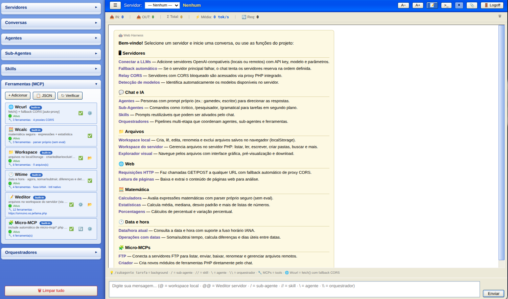

# Web Harness



**Web Harness** é uma interface web de chat com LLMs (compatível com a API OpenAI) pensada para rodar no navegador e orquestrar modelos, agentes e ferramentas de forma simples. Tudo é servido por um backend PHP leve com autenticação de sessão — sem dependências de frameworks pesados.

## Por que existe

Modelos de chat expostos via API costumam travar em três pontos no navegador: **CORS**, **mixed-content** (quando o site é HTTPS e o modelo é HTTP) e **esquemas de tool-calling** malformados. O Web Harness resolve isso com um *relay* server-side e uma camada de sanitização de schemas, permitindo usar tanto provedores na nuvem (ex.: Ollama Cloud) quanto instâncias Ollama locais.

## Funcionalidades

- **Chat com qualquer LLM OpenAI-compatible** — basta apontar a URL base e a chave (Bearer).
- **Relay CORS** — `lama.php?action=llm_relay` faz o proxy server-side das chamadas, contornando bloqueios de origem e HTTP/HTTPS.
- **Ferramentas MCP** — integra ferramentas como:
  - `Weditor` (leitura/edição de arquivos no servidor),
  - `Workspace` (listar/ler arquivos da área de trabalho),
  - `Wcalc` (cálculos),
  - `Wcurl` (requisições HTTP).
- **Orquestração** — agentes, sub-agentes, skills e orquestradores configuráveis, com temperatura e prompt próprios.
- **Visão multimodal** — anexe imagens; o app monta o conteúdo no formato `image_url` aceito pelos modelos.
- **Sanitização de schema (Ollama)** — converte propriedades `type: array` em `string` e remove `items`/`prefixItems` que quebram o parser do Ollama, garantindo tool-calling funcional.
- **Autenticação backend** — tela de login (`login.php`) com usuário e senha; o *relay* e todas as ações exigem sessão autenticada (cookie `HttpOnly` + `Secure` + `SameSite=Lax`).
- **Logoff** — encerra a sessão no servidor e retorna à tela de login.

## Arquitetura

```
lama.php        → backend único: relay de LLM, auth (login/logout) e ações da API
login.php       → tela de login (usuário/senha)
lama.html/js/css→ frontend (carregado pelo backend quando autenticado)
mcp.php         → micro-servidor MCP
micro-mcp/      → ferramentas MCP (editor, ftp, ui, criador...)
router.php      → roteamento auxiliar
funcoes.md      → documentação de funções/relay
```

O fluxo é: o navegador abre `lama.php` → se não autenticado, recebe `login.php` → após o login, o backend serve `lama.html` e o `lama.js` passa a chamar o *relay* `?action=llm_relay`, que por sua vez fala com o LLM escolhido.

## Autenticação

As credenciais padrão (definidas em `lama.php`) são:

- **Usuário:** `web`
- **Senha:** `harness`

Para alterar sem mexer no código, defina as variáveis de ambiente no servidor:

```bash
export LAMA_USER="seu_usuario"
export LAMA_PASS="sua_senha"
```

A sessão é mantida em `PHP_SESSION` com cookie seguro; a senha é validada no servidor via comparação *timing-safe* (`hash_equals`).

## Como usar

1. Suba os arquivos PHP em um servidor com PHP + cURL (ex.: InfinityFree, Apache, Nginx).
2. Acesse pela entrada que passa por `lama.php` (por exemplo `https://seudominio/lama.php` ou o índice que encaminha para ele).
   - **Não** abra o `lama.html` diretamente — ele não tem o *gate* de autenticação.
3. Faça login com `web` / `harness` (ou as credenciais de ambiente).
4. Configure a URL base do LLM e a chave (ex.: Ollama Cloud `https://ollama.com/v1`).
5. Converse, use tools/MCP, anexe imagens e orquestre agentes.

## Sandbox no localStorage

Todo o estado do app — servidores/configurações de LLM, skills, agentes, sub-agentes, orquestradores, conversas e estatísticas — é persistido no `localStorage` do navegador. Isso funciona como uma **sandbox client-side**: cada usuário tem seu próprio ambiente isolado, sem precisar de armazenamento no servidor nem de arquivos compartilhados.

- As configurações ficam restritas ao navegador/dispositivo (e ao perfil do navegador) de quem usa.
- É útil para criar e experimentar "arquivos" de configuração, prompts, skills e agentes no próprio navegador, sem mexer no backend — uma forma de *sandbox* leve e portátil.
- Para "limpar" o sandbox, basta limpar os dados do site no navegador; a sessão de autenticação (server-side) é independente disso.

Essa abordagem mantém o servidor enxuto (só relay + auth) e deixa a experimentação por conta do cliente.

## Observações

- O app é voltado para **uso pessoal/educacional**; revise as permissões de arquivos expostas pelas ferramentas MCP antes de disponibilizá-lo publicamente.
- Conexões a Ollama locais podem ser bloqueadas por *firewall* de hospedagem (egress) — nesse caso, use um provedor na nuvem.
- O diretório `.playwright-mcp/` (gravações de teste) fica fora do versionamento (`.gitignore`); o `workspace/` é versionado.
